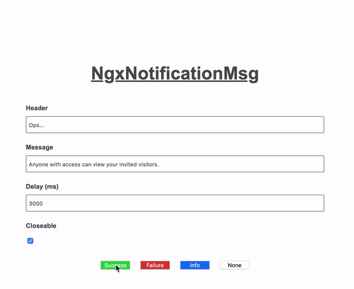

# NgxNotificationMsg

[](https://www.npmjs.com/package/ngx-notification-msg)
[](https://www.npmjs.com/package/ngx-notification-msg)

Angular Library to display notification message.

## Demo
ƒ
- You may visit the online usage example on https://maormoshe.github.io/NotificationMsgLibrary/



## Installation

1.&nbsp;Download from npm

`npm install ngx-notification-msg --save`

2.&nbsp;Import the `NgxNotificationMsgModule` module

`import {NgxNotificationMsgModule} from 'ngx-notification-msg'`

3.&nbsp;Add `NgxNotificationMsgModule` to your module imports

```ts
 @NgModule({ ... imports: [ ... NgxNotificationMsgModule ] })
```

4.&nbsp;Import the `NgxNotificationMsgService` service in any angular component

`import {NgxNotificationMsgService} from 'ngx-notification-msg'`

5.&nbsp;Inject the `NgxNotificationMsgService` service in the angular component's constructor

```ts
 constructor(private readonly ngxNotificationMsgService: NgxNotificationMsgService) {
 
 }
```
 
6.&nbsp;Now you can use `ngxNotificationMsgService` service

```ts
 this.ngxNotificationMsgService.open({
    status: NgxNotificationStatusMsg.SUCCESS,
    header: 'Hey',
    messages: ['How are you today ?!']
 });
```
 
## API

Use the `NgxNotificationMsgService` service in any angular component you like.

> #### Methods

```ts 
open(inputsConfig: INgxNotificationMsgConfig, element?: Element): void
```

## Enums & Interfaces

```ts
export enum NgxNotificationStatusMsg {
    SUCCESS = 'SUCCESS',
    FAILURE = 'FAILURE',
    INFO = 'INFO',
    NONE = 'NONE'
}

export enum NgxNotificationDirection {
    TOP = 'TOP',
    TOP_RIGHT = 'TOP_RIGHT',
    TOP_LEFT = 'TOP_LEFT',
    BOTTOM = 'BOTTOM',
    BOTTOM_RIGHT = 'BOTTOM_RIGHT',
    BOTTOM_LEFT = 'BOTTOM_LEFT'
}

interface INgxNotificationMsgConfig {
    status?: NgxNotificationStatusMsg;
    direction?: NgxNotificationDirection;
    header?: string;
    messages: string[];
    delay?: number;
    displayIcon?: boolean;
    displayProgressBar?: boolean;
    closeable?: boolean;
}
 ```
 
## Notes
* Multiple directions can't live at the same time.
